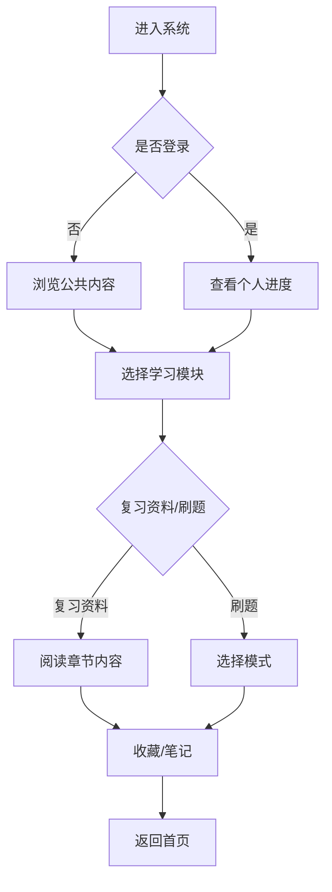

## 1. Product Overview
毛概复习系统是一个面向大学生和备考人员的在线学习平台，提供近几年最新的毛泽东思想和中国特色社会主义理论体系概论复习资料，以及配套的刷题库功能，帮助用户高效复习备考。

## 2. Core Features

### 2.1 User Roles
| Role | Registration Method | Core Permissions |
|------|---------------------|------------------|
| Anonymous User | No registration | Browse public content, practice questions |
| Registered User | Email/Phone | Save progress, bookmark favorites, track statistics |

### 2.2 Feature Module
1. **首页**: 学习进度概览、热门资料、每日一练入口
2. **复习资料**: 章节知识点梳理、重点难点解析、思维导图
3. **刷题中心**: 章节练习、模拟考试、错题本、答题记录
4. **个人中心**: 学习统计、收藏管理、账号设置

### 2.3 Page Details
| Page Name | Module Name | Feature description |
|-----------|-------------|---------------------|
| 首页 | Hero Section | 展示系统核心功能，引导用户开始学习 |
| 首页 | Progress Overview | 显示用户学习进度、今日完成情况 |
| 首页 | Quick Access | 快捷入口：开始学习、每日一练、模拟考试 |
| 复习资料 | Chapter List | 按章节组织的复习资料列表 |
| 复习资料 | Content View | 知识点详细内容展示，支持阅读模式 |
| 复习资料 | Mind Map | 章节内容思维导图可视化 |
| 刷题中心 | Practice Mode | 按章节选择题目进行练习 |
| 刷题中心 | Exam Mode | 模拟考试，限时答题 |
| 刷题中心 | Wrong Book | 收集做错的题目，方便回顾 |
| 刷题中心 | Statistics | 答题统计分析 |
| 个人中心 | Profile | 用户信息展示与编辑 |
| 个人中心 | Learning Stats | 学习时长、正确率等数据统计 |
| 个人中心 | Favorites | 收藏的资料和题目管理 |

## 3. Core Process

### 学习流程
用户进入首页 → 选择学习模块 → 阅读复习资料/开始刷题 → 查看答题结果 → 记录错题 → 继续巩固练习

### 刷题流程
选择刷题模式 → 选择章节/难度 → 答题 → 查看解析 → 自动记录到错题本（如有错误）

## 4. User Interface Design

### 4.1 Design Style
- **主色调**: 红色 (#DC2626) 为主色，象征中国特色社会主义主题
- **辅助色**: 深灰 (#1F2937) 为背景，白色 (#FFFFFF) 为内容区
- **按钮样式**: 圆角矩形，红色主按钮，灰色次要按钮
- **字体**: 思源黑体 (Noto Sans SC)，标题加粗，正文清晰易读
- **布局风格**: 卡片式布局，左侧导航，右侧内容区
- **图标**: 使用 Lucide React 图标库

### 4.2 Page Design Overview
| Page Name | Module Name | UI Elements |
|-----------|-------------|-------------|
| 首页 | Hero Section | 红色渐变背景，白色文字标题，CTA按钮 |
| 首页 | Progress Cards | 统计卡片，带进度条，数字动画 |
| 复习资料 | Navigation | 左侧章节树，右侧内容滚动区 |
| 复习资料 | Content | 标题层级清晰，重点内容高亮，代码块样式 |
| 刷题中心 | Question Card | 题目卡片，选项按钮，答题反馈动画 |
| 刷题中心 | Results | 答题结果统计，正确率展示，解析展开 |
| 个人中心 | Profile Card | 用户头像，统计数据网格布局 |

### 4.3 Responsiveness
- **桌面端**: 完整三栏布局（导航+内容+侧边栏）
- **平板端**: 两栏布局（导航折叠+内容区）
- **移动端**: 单栏布局，底部导航，侧边抽屉

### 4.4 3D Scene Guidance
不适用本项目

## 5. Content Requirements

### 5.1 复习资料内容
- 毛泽东思想及其历史地位
- 新民主主义革命理论
- 社会主义改造理论
- 社会主义建设道路初步探索
- 邓小平理论
- "三个代表"重要思想
- 科学发展观
- 习近平新时代中国特色社会主义思想概论

### 5.2 题库结构
- 单选题：每题1分，共30题
- 多选题：每题2分，共10题
- 简答题：每题10分，共3题
- 论述题：每题15分，共2题

### 5.3 数据来源
- 教材：《毛泽东思想和中国特色社会主义理论体系概论》（最新版）
- 历年真题：2020-2025年考研政治、期末考试真题
- 模拟题：根据考点编写的练习题
