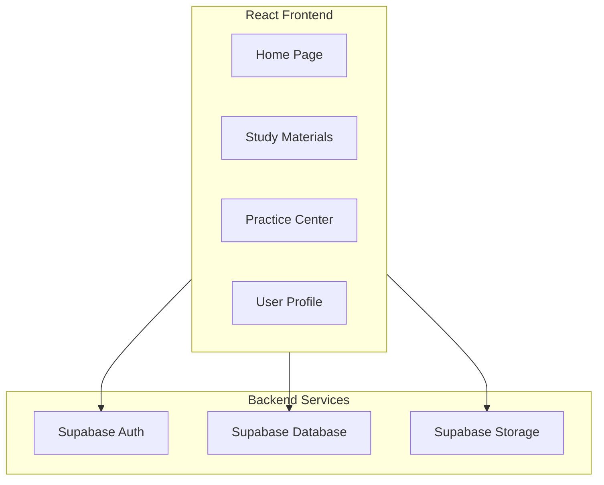
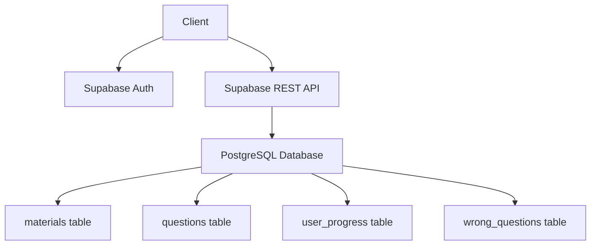
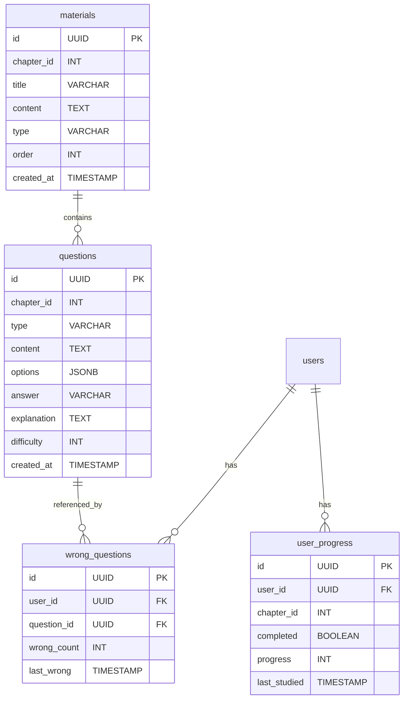

## 1. Architecture Design



## 2. Technology Description
- **Frontend**: React@18 + TypeScript + TailwindCSS@3 + Vite
- **Initialization Tool**: vite-init
- **Backend**: Supabase (Auth, Database, Storage)
- **State Management**: Zustand
- **Routing**: React Router DOM
- **Icons**: Lucide React
- **Charting**: Recharts

## 3. Route Definitions
| Route | Purpose |
|-------|---------|
| / | 首页 - 学习进度概览 |
| /materials | 复习资料 - 章节内容浏览 |
| /materials/:id | 资料详情 - 具体章节内容 |
| /practice | 刷题中心 - 练习模式 |
| /practice/chapter/:id | 章节练习 - 按章节刷题 |
| /exam | 模拟考试 - 限时答题 |
| /wrong-book | 错题本 - 错题回顾 |
| /profile | 个人中心 - 用户信息与统计 |

## 4. API Definitions

### 4.1 Authentication
- `supabase.auth.signUp()` - 用户注册
- `supabase.auth.signInWithPassword()` - 用户登录
- `supabase.auth.signOut()` - 用户退出
- `supabase.auth.getUser()` - 获取当前用户

### 4.2 Study Materials
- `supabase.from('materials').select('*')` - 获取所有资料
- `supabase.from('materials').select('*').eq('chapter_id', id)` - 获取章节资料
- `supabase.from('materials').select('*').eq('id', id)` - 获取单篇资料

### 4.3 Questions
- `supabase.from('questions').select('*').eq('chapter_id', id)` - 获取章节题目
- `supabase.from('questions').select('*').eq('type', type)` - 按题型筛选
- `supabase.from('questions').select('*').limit(limit)` - 随机抽取题目

### 4.4 User Progress
- `supabase.from('user_progress').select('*').eq('user_id', uid)` - 获取用户进度
- `supabase.from('user_progress').upsert({...})` - 更新用户进度
- `supabase.from('wrong_questions').select('*').eq('user_id', uid)` - 获取错题
- `supabase.from('wrong_questions').insert({...})` - 添加错题
- `supabase.from('wrong_questions').delete().eq('id', id)` - 删除错题

## 5. Server Architecture Diagram



## 6. Data Model

### 6.1 Data Model Definition



### 6.2 Data Definition Language

```sql
CREATE TABLE materials (
    id UUID PRIMARY KEY DEFAULT uuid_generate_v4(),
    chapter_id INT NOT NULL,
    title VARCHAR(255) NOT NULL,
    content TEXT NOT NULL,
    type VARCHAR(50) DEFAULT 'text',
    order INT DEFAULT 0,
    created_at TIMESTAMP DEFAULT NOW()
);

CREATE TABLE questions (
    id UUID PRIMARY KEY DEFAULT uuid_generate_v4(),
    chapter_id INT NOT NULL,
    type VARCHAR(50) NOT NULL,
    content TEXT NOT NULL,
    options JSONB NOT NULL,
    answer VARCHAR(100) NOT NULL,
    explanation TEXT,
    difficulty INT DEFAULT 1,
    created_at TIMESTAMP DEFAULT NOW()
);

CREATE TABLE user_progress (
    id UUID PRIMARY KEY DEFAULT uuid_generate_v4(),
    user_id UUID NOT NULL,
    chapter_id INT NOT NULL,
    completed BOOLEAN DEFAULT FALSE,
    progress INT DEFAULT 0,
    last_studied TIMESTAMP,
    FOREIGN KEY (user_id) REFERENCES auth.users(id)
);

CREATE TABLE wrong_questions (
    id UUID PRIMARY KEY DEFAULT uuid_generate_v4(),
    user_id UUID NOT NULL,
    question_id UUID NOT NULL,
    wrong_count INT DEFAULT 1,
    last_wrong TIMESTAMP DEFAULT NOW(),
    FOREIGN KEY (user_id) REFERENCES auth.users(id),
    FOREIGN KEY (question_id) REFERENCES questions(id)
);

CREATE INDEX idx_materials_chapter ON materials(chapter_id);
CREATE INDEX idx_questions_chapter ON questions(chapter_id);
CREATE INDEX idx_questions_type ON questions(type);
CREATE INDEX idx_user_progress_user ON user_progress(user_id);
CREATE INDEX idx_wrong_questions_user ON wrong_questions(user_id);
```

### 6.3 RLS Policies

```sql
ALTER TABLE materials ENABLE ROW LEVEL SECURITY;
ALTER TABLE questions ENABLE ROW LEVEL SECURITY;
ALTER TABLE user_progress ENABLE ROW LEVEL SECURITY;
ALTER TABLE wrong_questions ENABLE ROW LEVEL SECURITY;

CREATE POLICY "Allow public read access to materials" ON materials
    FOR SELECT USING (true);

CREATE POLICY "Allow public read access to questions" ON questions
    FOR SELECT USING (true);

CREATE POLICY "Allow authenticated users to access their progress" ON user_progress
    FOR SELECT USING (auth.uid() = user_id);

CREATE POLICY "Allow authenticated users to update their progress" ON user_progress
    FOR INSERT WITH CHECK (auth.uid() = user_id);

CREATE POLICY "Allow authenticated users to update their progress" ON user_progress
    FOR UPDATE WITH CHECK (auth.uid() = user_id);

CREATE POLICY "Allow authenticated users to access their wrong questions" ON wrong_questions
    FOR SELECT USING (auth.uid() = user_id);

CREATE POLICY "Allow authenticated users to add wrong questions" ON wrong_questions
    FOR INSERT WITH CHECK (auth.uid() = user_id);

CREATE POLICY "Allow authenticated users to delete wrong questions" ON wrong_questions
    FOR DELETE USING (auth.uid() = user_id);

GRANT SELECT ON materials TO anon;
GRANT SELECT ON questions TO anon;
GRANT ALL PRIVILEGES ON user_progress TO authenticated;
GRANT ALL PRIVILEGES ON wrong_questions TO authenticated;
```
